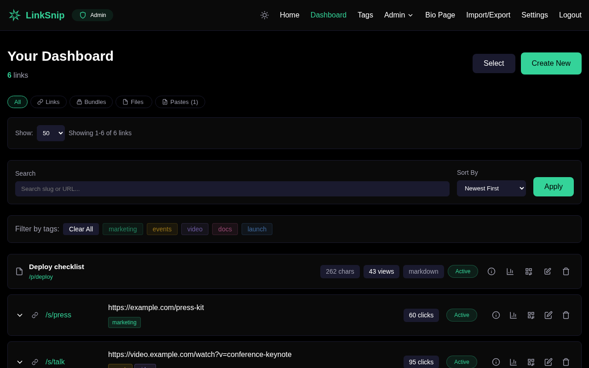
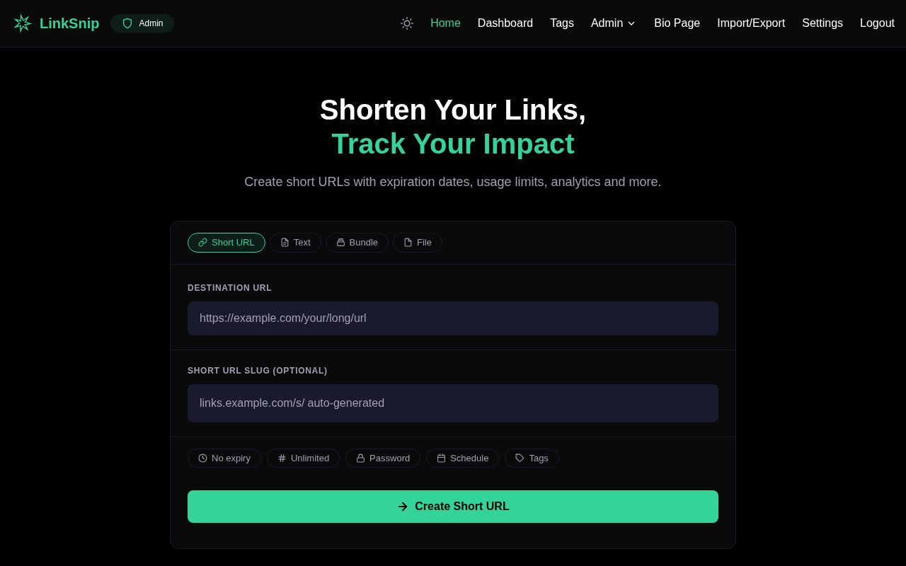
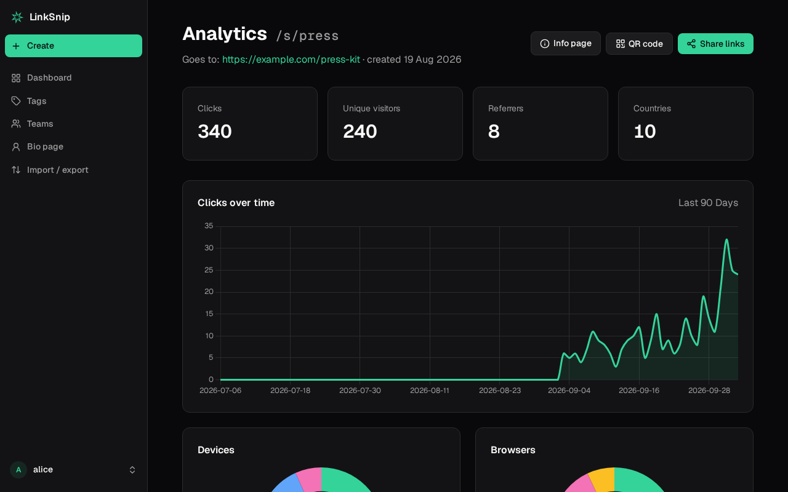
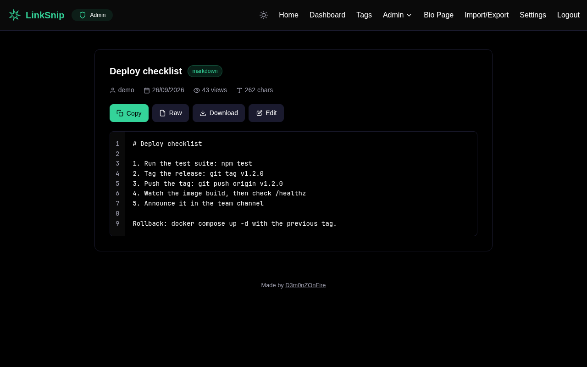
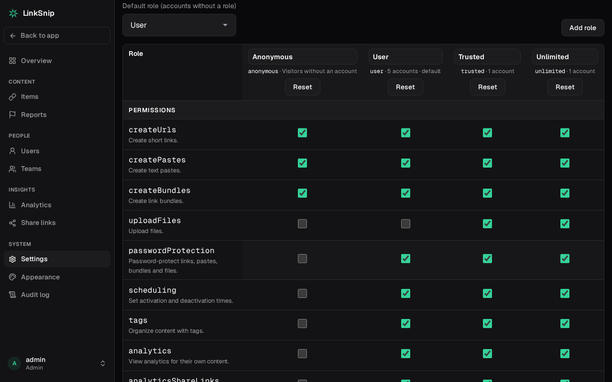

# LinkSnip

[](https://github.com/D3m0nZOnFire/LinkSnip/actions/workflows/ci.yml)
[](https://github.com/D3m0nZOnFire/LinkSnip/releases)
[](LICENSE)

A self-hosted URL shortener that also shares text, files and groups of links. It runs as one Docker container with a
SQLite database, and everything it stores lives in a single `data/` folder.



## Features

- **Short links** with custom slugs, expiry, click limits, passwords and activation/deactivation times
- **Pastes**: share text at `/p/…`, with line numbers, raw view and an editor
- **Files**: share uploads at `/f/…`, with per-role size limits and storage quotas
- **Bundles**: one link that opens several links at once
- **Bio pages**: a public page listing a user's chosen links
- **Analytics**: clicks over time, referrers, countries, devices, browsers and operating systems. Visitor IPs are only stored as keyed hashes.
- **Analytics share links**: read-only, revocable `/stats/…` links for people without an account
- **QR codes**, **tags**, and **bulk import/export** (CSV, JSON, plain text)
- **Roles**: you decide what each kind of account, and visitors without one, may do and how much, in the file or in the admin panel
- **Teams**: links, bundles, pastes and files shared by several people, with owner, admin, member and viewer roles
- **Moderation**: visitors can report links, bundles, pastes and files; reported items show a warning page until an admin blocks or clears them
- **Your own look**: site name, tagline, logo and favicon, and a dark and a light color palette, from the built-in ones or your own
- **Admin panel**: an overview, every item in one searchable list, users, teams, reports, settings, roles and appearance, and a full audit log
- **Operations**: nightly online backups and cleanup of expired content

### Screenshots

| | |
|---|---|
|  |  |
| **Create** links, pastes, bundles and files | **Analytics** per link, shareable read-only |
|  |  |
| **Pastes** with line numbers, raw view and editor | **Roles**: permissions and limits per kind of account |

## Quick start (Docker)

You need Docker with Compose.

```bash
git clone https://github.com/D3m0nZOnFire/LinkSnip.git
cd LinkSnip

cp .env.example .env
sed -i "s/^SESSION_SECRET=.*/SESSION_SECRET=$(openssl rand -hex 32)/" .env
sed -i "s/^IP_HASH_SECRET=.*/IP_HASH_SECRET=$(openssl rand -hex 32)/" .env
mkdir -p data          # must be writable by uid 1000; see "Troubleshooting"

docker compose up -d
```

LinkSnip now listens on `http://127.0.0.1:8081`, reachable only from this machine.

### Create the first admin

On first start LinkSnip prints a one-time setup code:

```bash
docker compose logs linksnip | grep "setup code"
```

Open `http://127.0.0.1:8081`, which redirects to `/setup`, and enter the code with a username and password for the
admin account. Once an admin exists, `/setup` is gone for good.

To manage admin accounts from the command line (create, promote a user, reset a password):

```bash
docker compose exec linksnip npm run admin
```

### HTTPS

To have the bundled Caddy get a certificate and serve LinkSnip on your domain, point the domain's DNS at the server,
open ports 80 and 443, and run:

```bash
DOMAIN=links.example.com docker compose --profile caddy up -d
```

You can also put `DOMAIN=links.example.com` in `.env`. To use a reverse proxy you already run instead, see
[docs/DEPLOYMENT.md](docs/DEPLOYMENT.md).

## Configuration

| Where | What |
|---|---|
| `.env` | Infrastructure only: `SESSION_SECRET`, `IP_HASH_SECRET`, `DATA_DIR`, `PORT`, `NODE_ENV`, `TRUST_PROXY` |
| `data/settings.json` | Registration, feature switches, moderation, anonymous limits, retention, … Also editable in **Admin → Settings** |
| `data/roles.json` | Roles: what each kind of account (and anonymous visitors) may do, and their limits |

Both JSON files are created with every option on first start. Edits apply within a few seconds, without a restart.
An invalid edit is logged and the previous configuration stays in use.

The built-in roles are `anonymous`, `user` (the default for new accounts), `trusted` (higher limits, file uploads) and
`unlimited`. Admins have every permission and no limits. Set a user's role in **Admin → Users**.

Every option is listed in **[docs/CONFIGURATION.md](docs/CONFIGURATION.md)**.

> **Country lookup** is local: LinkSnip downloads the free [DB-IP Lite](https://db-ip.com) country database (CC BY 4.0)
> into `data/geo/` and refreshes it monthly. Visitor IPs never leave your server. Set `geo.enabled` to `false` in
> `settings.json` to record no countries at all.

## Backups and restoring

Everything LinkSnip stores is in `data/`: the database, uploaded files, backups, `settings.json` and `roles.json`.

- A consistent copy of the database is saved to `data/backups/` every night at 3:00 and kept for 30 days.
  Admins can also start one from **Admin → Audit Logs**.
- Uploaded files are not in the database. Back up `data/uploads/` too, or simply the whole `data/` folder.

To restore a database backup:

```bash
docker compose down
sqlite3 data/backups/database-backup-<date>.sqlite "PRAGMA integrity_check"   # should print "ok"
rm -f data/database.db-wal data/database.db-shm
cp data/backups/database-backup-<date>.sqlite data/database.db
docker compose up -d
```

Database migrations run automatically on start, so a backup from an older version is brought up to date.

## Updating

```bash
git pull
docker compose up -d --build
```

## Troubleshooting

- **"SESSION_SECRET is not set"** or **"IP_HASH_SECRET is not set"**: create `.env` as shown in the quick start.
- **"The data directory /data is not writable"**: the container runs as uid 1000. Fix it with `sudo chown -R 1000:1000 ./data`.
- **Lost the setup code**: restart the container (`docker compose restart linksnip`) to print a new one, or use
  `docker compose exec linksnip npm run admin`.
- **Health**: `curl http://127.0.0.1:8081/healthz` answers `{"status":"ok"}` when the app and database respond.

## Development

Requires Node.js 22.

```bash
npm ci
cp .env.example .env    # then set SESSION_SECRET and IP_HASH_SECRET
npm run dev             # http://localhost:8081, reloads on changes
npm test
```

Without `DATA_DIR`, data is stored in the project folder. See [CONTRIBUTING.md](CONTRIBUTING.md) before opening a
pull request.

To try every page with realistic data (accounts of every kind, links, bundles, pastes and files in every status,
teams, reports, a month of visits), fill a separate demo instance:

```bash
npm run seed:demo                      # into ./demo-data (--reset to start over)
DATA_DIR=./demo-data npm run dev       # log in as admin / demo-password
```

## Documentation

- [docs/DEPLOYMENT.md](docs/DEPLOYMENT.md): Docker with Caddy, behind an existing proxy, or bare Node
- [docs/CONFIGURATION.md](docs/CONFIGURATION.md): every setting, permission and limit
- [CONTRIBUTING.md](CONTRIBUTING.md): development setup and pull requests
- [SECURITY.md](SECURITY.md): reporting a vulnerability

## License

[MIT](LICENSE). Made by [D3m0nZOnFire](https://github.com/D3m0nZOnFire).

The color palettes are inspired by the themes of [Omarchy](https://github.com/omacom/omarchy).
